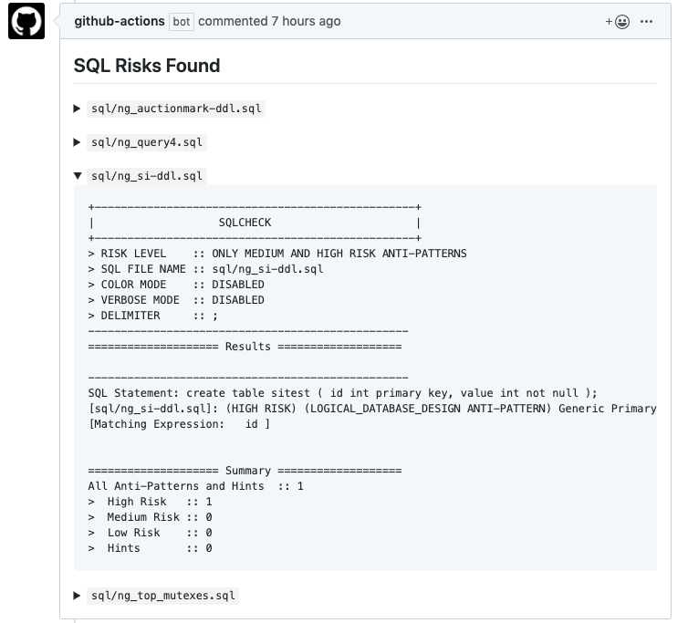

# action-sqlcheck

GitHub Actions that automatically identifies anti-patterns in SQL queries using [sqlcheck](https://github.com/jarulraj/sqlcheck) when PR is requested  and comment on the PR if risks are found in the queries  



## Usage

Supports `pull_request` event type.

### Inputs
|Parameter|Required|Default Value|Description|
|:--:|:--:|:--:|:--|
|`post-comment`|false|true|Post comment to PR if it's true|
|`token`|true|""|GitHub Token in order to add comment to PR|
|`risk-level`|false|3|Set of SQL anti-patterns to check: 1,2, or 3<br>- 1 (all anti-patterns, default)<br>- 2 (only medium and high risk anti-patterns)<br> - 3 (only high risk anti-patterns) |
|`verbose`|false|false|Add verbose warnings to SQLCheck analysis result|
|`postfixes`|false|"sql"|List of file postfix to match ( separator: comma )|

## Sample Workflow

> examples/workflow.yml
```yml
name: sqlcheck workflow
on: pull_request

jobs:
  sqlcheck:
    name: sqlcheck job 
    runs-on: ubuntu-latest
    steps:
    - uses: actions/checkout@master
    - uses: yokawasa/action-sqlcheck@v1.2.1
      with:
        post-comment: true
        risk-level: 3
        verbose: false
        token: ${{ secrets.GITHUB_TOKEN }}
```

